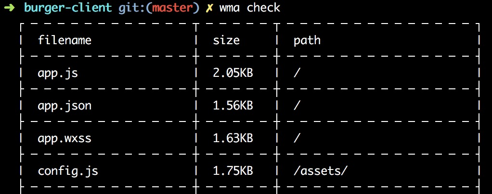
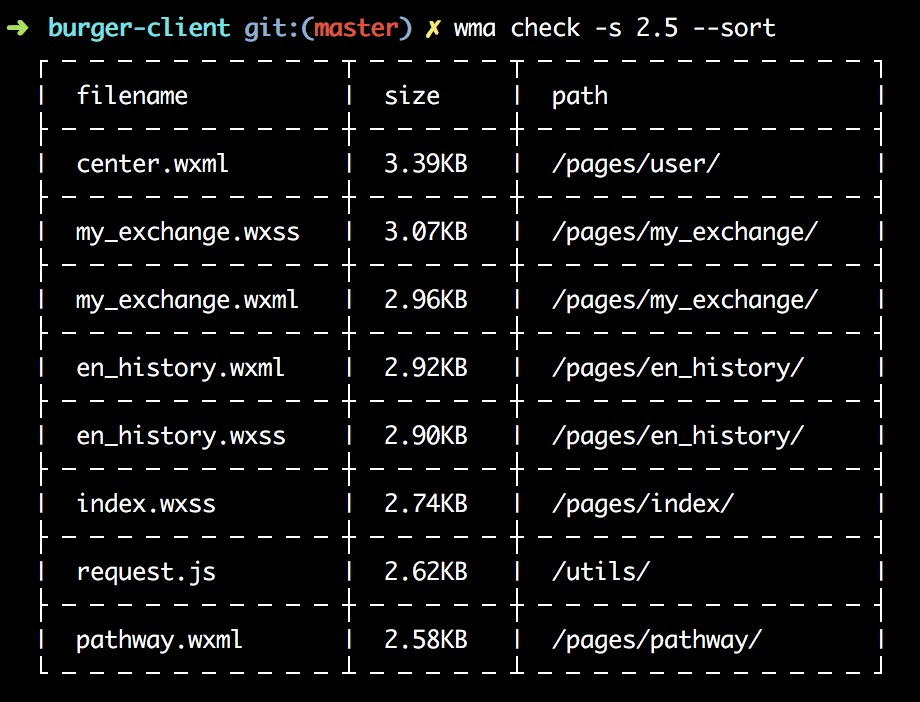
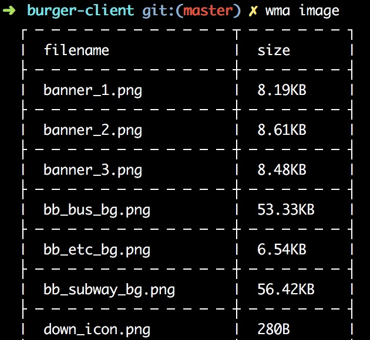
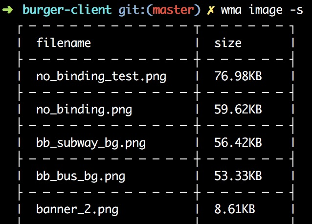

# miniprogram-analyzer
a command-line tools for WeChat miniprogram to analyze your project

# install
```js
npm install miniprogram-analyzer -g
```

# usage
安装完成后可在相应的小程序目录使用`wma`命令开始分析你的项目

目前仅有两个功能：分析文件和查找项目中未使用的图片(仅做参考)

### 分析文件
```js
wma check [option]

option:
    -s, --size  按文件大小进行筛选,单位为KB
    --sort      按文件大小排序(降序)
```




### 查找图片
```js
wma image_check|image [option]

option:
    -s, --sort      按文件大小进行排序(降序)
    -d, --delete    查找图片并删除(谨慎使用)
```




# LICENSE
MIT